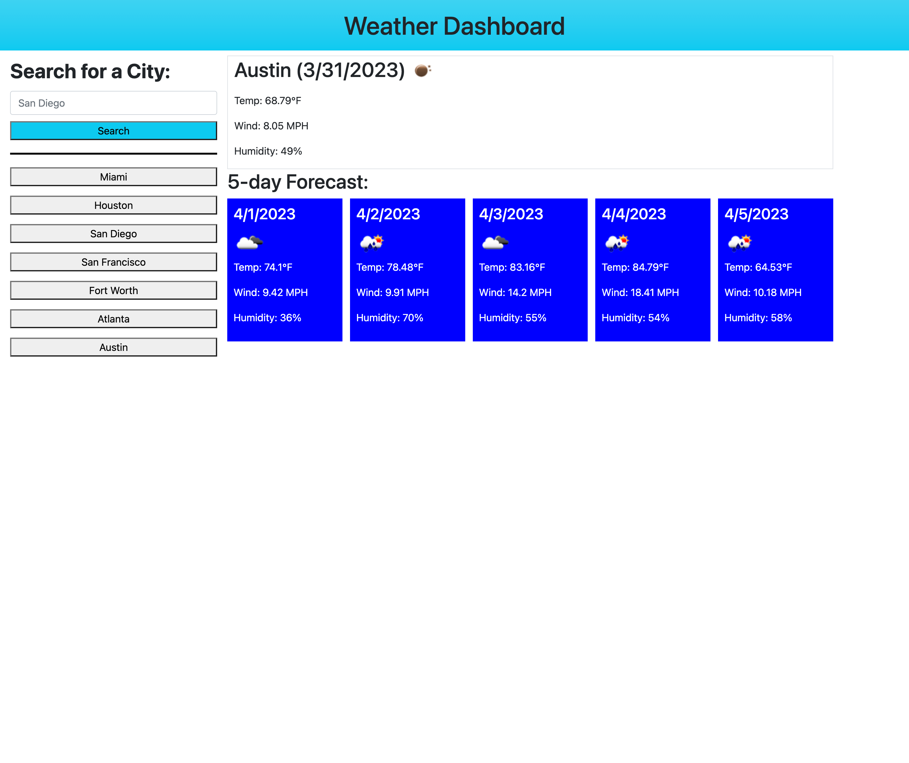

# Weather Dashboard

## Description
This web application was created to generate the current weather and a five day forecast for a city that the user searches for.

## Usage
When the website is loaded the user has the option to enter a city name in the search bar on the left-hand side. When the user submits their search the current weather will be displayed on the page along with the five-day forecast for that city. The city will also appear in the history below the search bar. The user has the option to click on any of the cities listed in the history to look up the weather conditions for any previously searched for cities.

You can visit the website [here](https://jakefair97.github.io/weather-dashboard/) and view a screenshot of the webpage below:

## Credits
This web app utilizes the OpenWeatherMap API to retrieve the weather data, Bootstrap for the design of the webpage, and jQuery to simplify the JS code.

## License
Please refer to the LICENSE in the repo.
